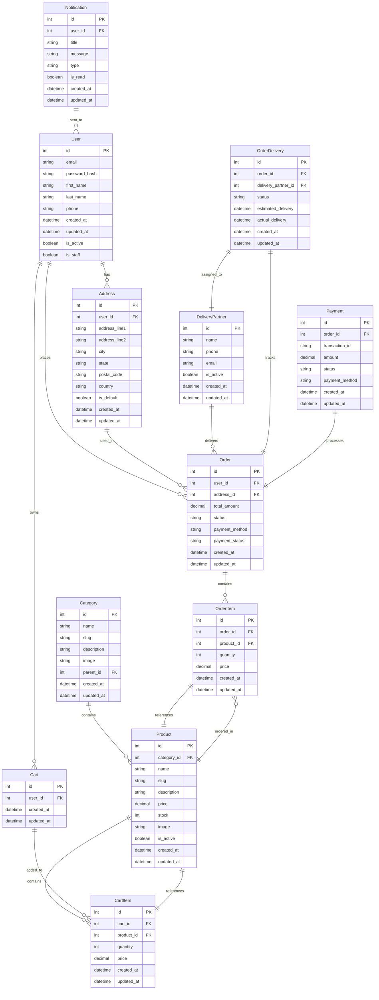
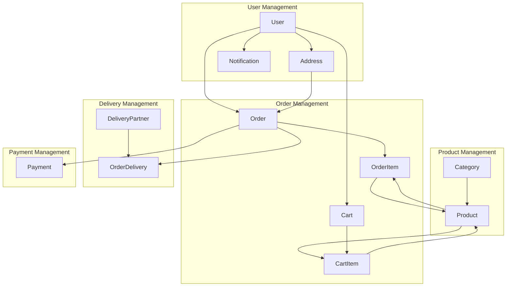
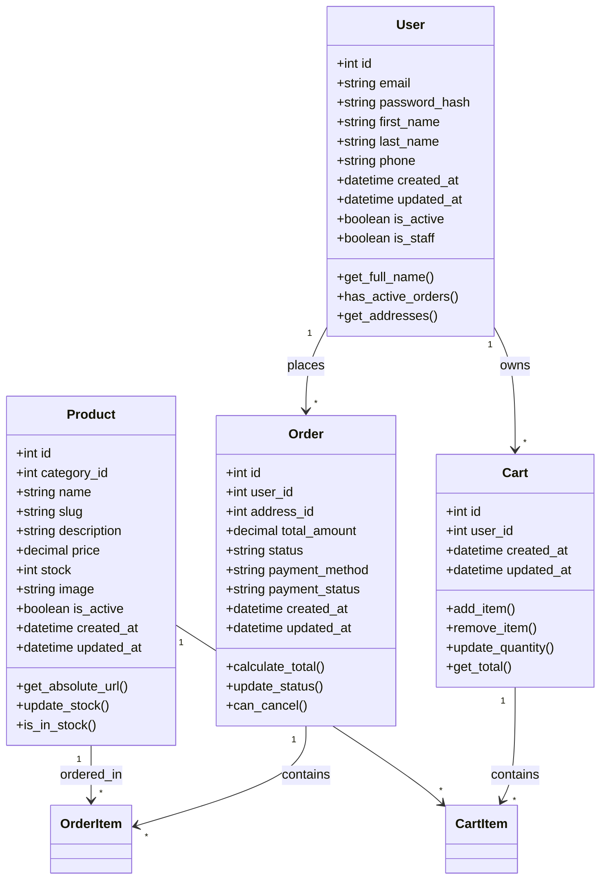

```mermaid
erDiagram
    User ||--o{ Order : places
    User ||--o{ Address : has
    User ||--o{ Cart : owns
    User {
        int id PK
        string email
        string password_hash
        string first_name
        string last_name
        string phone
        datetime created_at
        datetime updated_at
        boolean is_active
        boolean is_staff
    }

    Address ||--o{ Order : used_in
    Address {
        int id PK
        int user_id FK
        string address_line1
        string address_line2
        string city
        string state
        string postal_code
        string country
        boolean is_default
        datetime created_at
        datetime updated_at
    }

    Category ||--o{ Product : contains
    Category {
        int id PK
        string name
        string slug
        string description
        string image
        int parent_id FK
        datetime created_at
        datetime updated_at
    }

    Product ||--o{ CartItem : added_to
    Product ||--o{ OrderItem : ordered_in
    Product {
        int id PK
        int category_id FK
        string name
        string slug
        string description
        decimal price
        int stock
        string image
        boolean is_active
        datetime created_at
        datetime updated_at
    }

    Cart ||--o{ CartItem : contains
    Cart {
        int id PK
        int user_id FK
        datetime created_at
        datetime updated_at
    }

    CartItem ||--|| Product : references
    CartItem {
        int id PK
        int cart_id FK
        int product_id FK
        int quantity
        decimal price
        datetime created_at
        datetime updated_at
    }

    Order ||--o{ OrderItem : contains
    Order {
        int id PK
        int user_id FK
        int address_id FK
        decimal total_amount
        string status
        string payment_method
        string payment_status
        datetime created_at
        datetime updated_at
    }

    OrderItem ||--|| Product : references
    OrderItem {
        int id PK
        int order_id FK
        int product_id FK
        int quantity
        decimal price
        datetime created_at
        datetime updated_at
    }

    DeliveryPartner ||--o{ Order : delivers
    DeliveryPartner {
        int id PK
        string name
        string phone
        string email
        boolean is_active
        datetime created_at
        datetime updated_at
    }

    OrderDelivery ||--|| Order : tracks
    OrderDelivery ||--|| DeliveryPartner : assigned_to
    OrderDelivery {
        int id PK
        int order_id FK
        int delivery_partner_id FK
        string status
        datetime estimated_delivery
        datetime actual_delivery
        datetime created_at
        datetime updated_at
    }

    Payment ||--|| Order : processes
    Payment {
        int id PK
        int order_id FK
        string transaction_id
        decimal amount
        string status
        string payment_method
        datetime created_at
        datetime updated_at
    }

    Notification ||--o{ User : sent_to
    Notification {
        int id PK
        int user_id FK
        string title
        string message
        string type
        boolean is_read
        datetime created_at
        datetime updated_at
    }
```

```mermaid
graph TD
    subgraph User Management
        User[User]
        Address[Address]
        Notification[Notification]
    end

    subgraph Product Management
        Category[Category]
        Product[Product]
    end

    subgraph Order Management
        Order[Order]
        OrderItem[OrderItem]
        Cart[Cart]
        CartItem[CartItem]
    end

    subgraph Delivery Management
        DeliveryPartner[DeliveryPartner]
        OrderDelivery[OrderDelivery]
    end

    subgraph Payment Management
        Payment[Payment]
    end

    %% User Management Relationships
    User --> Address
    User --> Notification
    User --> Order
    User --> Cart

    %% Product Management Relationships
    Category --> Product
    Product --> CartItem
    Product --> OrderItem

    %% Order Management Relationships
    Order --> OrderItem
    Cart --> CartItem
    Order --> Payment

    %% Delivery Management Relationships
    Order --> OrderDelivery
    DeliveryPartner --> OrderDelivery

    %% Additional Relationships
    Address --> Order
    CartItem --> Product
    OrderItem --> Product
```

```mermaid
classDiagram
    class User {
        +int id
        +string email
        +string password_hash
        +string first_name
        +string last_name
        +string phone
        +datetime created_at
        +datetime updated_at
        +boolean is_active
        +boolean is_staff
        +get_full_name()
        +has_active_orders()
        +get_addresses()
    }

    class Product {
        +int id
        +int category_id
        +string name
        +string slug
        +string description
        +decimal price
        +int stock
        +string image
        +boolean is_active
        +datetime created_at
        +datetime updated_at
        +get_absolute_url()
        +update_stock()
        +is_in_stock()
    }

    class Order {
        +int id
        +int user_id
        +int address_id
        +decimal total_amount
        +string status
        +string payment_method
        +string payment_status
        +datetime created_at
        +datetime updated_at
        +calculate_total()
        +update_status()
        +can_cancel()
    }

    class Cart {
        +int id
        +int user_id
        +datetime created_at
        +datetime updated_at
        +add_item()
        +remove_item()
        +update_quantity()
        +get_total()
    }

    User "1" --> "*" Order : places
    User "1" --> "*" Cart : owns
    Product "1" --> "*" CartItem : added_to
    Product "1" --> "*" OrderItem : ordered_in
    Order "1" --> "*" OrderItem : contains
    Cart "1" --> "*" CartItem : contains
``` 