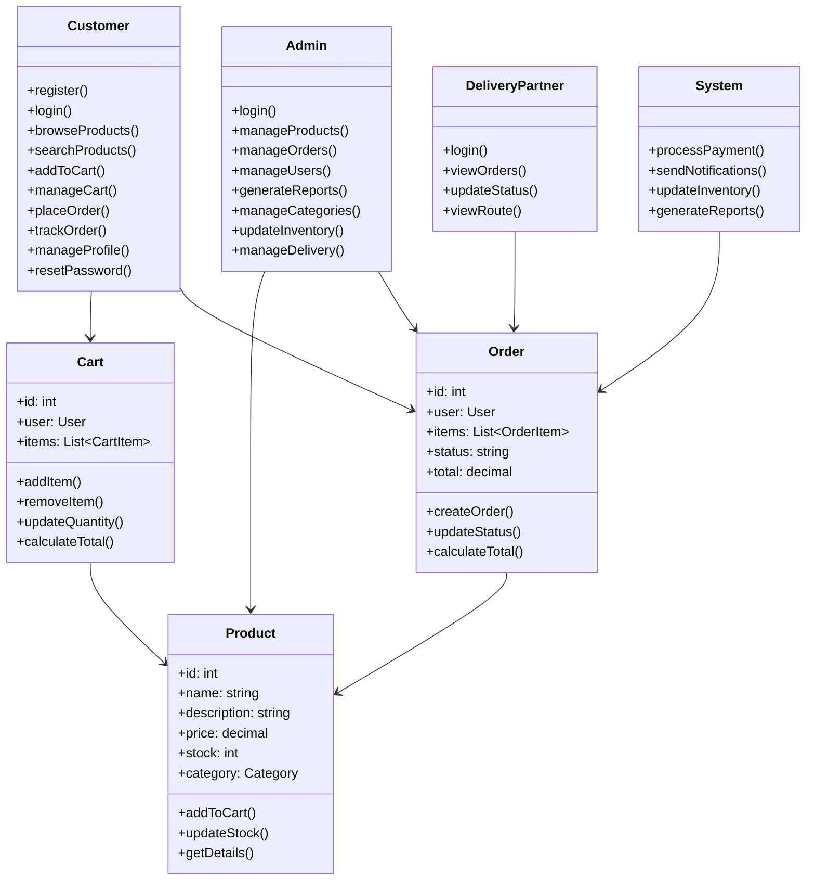
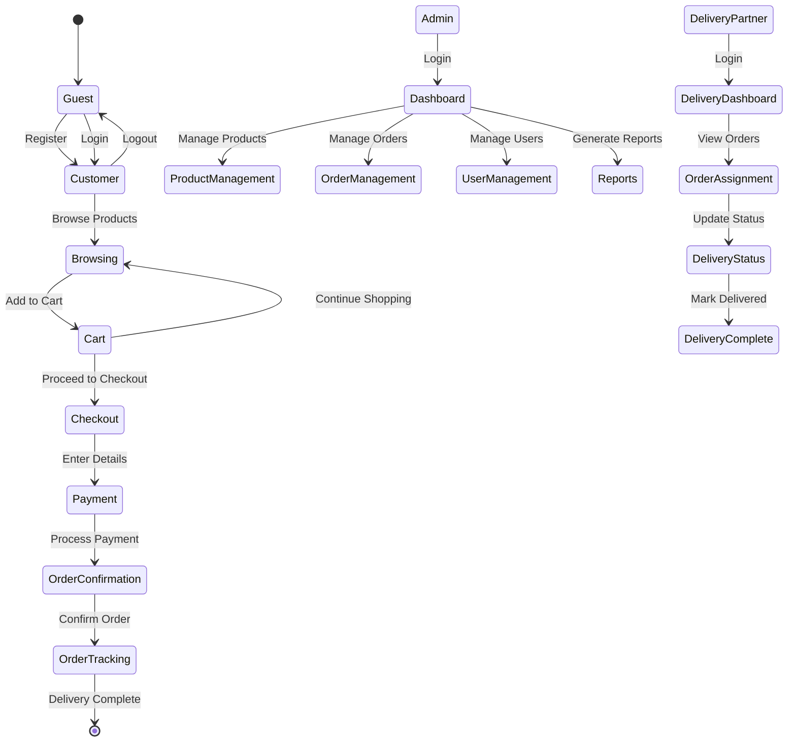

```mermaid
graph TD
    %% Actors
    Customer((Customer))
    Admin((Admin))
    Delivery((Delivery Partner))
    System((System))
    
    %% Customer Use Cases
    Customer -->|1. Register| UC1[Register Account]
    Customer -->|2. Login| UC2[Login]
    Customer -->|3. Browse Products| UC3[Browse Products]
    Customer -->|4. Search Products| UC4[Search Products]
    Customer -->|5. Add to Cart| UC5[Add to Cart]
    Customer -->|6. Manage Cart| UC6[Manage Cart]
    Customer -->|7. Place Order| UC7[Place Order]
    Customer -->|8. Track Order| UC8[Track Order]
    Customer -->|9. Manage Profile| UC9[Manage Profile]
    Customer -->|10. Reset Password| UC10[Reset Password]
    
    %% Admin Use Cases
    Admin -->|1. Login| A1[Admin Login]
    Admin -->|2. Manage Products| A2[Manage Products]
    Admin -->|3. Manage Orders| A3[Manage Orders]
    Admin -->|4. Manage Users| A4[Manage Users]
    Admin -->|5. Generate Reports| A5[Generate Reports]
    Admin -->|6. Manage Categories| A6[Manage Categories]
    Admin -->|7. Update Inventory| A7[Update Inventory]
    Admin -->|8. Manage Delivery| A8[Manage Delivery]
    
    %% Delivery Partner Use Cases
    Delivery -->|1. Login| D1[Delivery Login]
    Delivery -->|2. View Orders| D2[View Orders]
    Delivery -->|3. Update Status| D3[Update Status]
    Delivery -->|4. View Route| D4[View Route]
    
    %% System Use Cases
    System -->|1. Process Payment| S1[Process Payment]
    System -->|2. Send Notifications| S2[Send Notifications]
    System -->|3. Update Inventory| S3[Update Inventory]
    System -->|4. Generate Reports| S4[Generate Reports]
    
    %% Include Relationships
    UC7 -->|includes| S1
    UC7 -->|includes| S3
    A2 -->|includes| S3
    A3 -->|includes| S2
    
    %% Extend Relationships
    UC3 -->|extends| UC4
    UC5 -->|extends| UC6
    A2 -->|extends| A6
    A3 -->|extends| A8
    
    %% Generalization
    UC1 -->|generalizes| UC10
    A1 -->|generalizes| A2
    A1 -->|generalizes| A3
    A1 -->|generalizes| A4
    A1 -->|generalizes| A5
    A1 -->|generalizes| A6
    A1 -->|generalizes| A7
    A1 -->|generalizes| A8
```

```mermaid
classDiagram
    class Customer {
        +register()
        +login()
        +browseProducts()
        +searchProducts()
        +addToCart()
        +manageCart()
        +placeOrder()
        +trackOrder()
        +manageProfile()
        +resetPassword()
    }
    
    class Admin {
        +login()
        +manageProducts()
        +manageOrders()
        +manageUsers()
        +generateReports()
        +manageCategories()
        +updateInventory()
        +manageDelivery()
    }
    
    class DeliveryPartner {
        +login()
        +viewOrders()
        +updateStatus()
        +viewRoute()
    }
    
    class System {
        +processPayment()
        +sendNotifications()
        +updateInventory()
        +generateReports()
    }
    
    class Product {
        +id: int
        +name: string
        +description: string
        +price: decimal
        +stock: int
        +category: Category
        +addToCart()
        +updateStock()
        +getDetails()
    }
    
    class Order {
        +id: int
        +user: User
        +items: List~OrderItem~
        +status: string
        +total: decimal
        +createOrder()
        +updateStatus()
        +calculateTotal()
    }
    
    class Cart {
        +id: int
        +user: User
        +items: List~CartItem~
        +addItem()
        +removeItem()
        +updateQuantity()
        +calculateTotal()
    }
    
    Customer --> Cart
    Customer --> Order
    Admin --> Product
    Admin --> Order
    DeliveryPartner --> Order
    System --> Order
    Cart --> Product
    Order --> Product
```

```mermaid
stateDiagram-v2
    [*] --> Guest
    Guest --> Customer: Register
    Guest --> Customer: Login
    Customer --> Guest: Logout
    
    Customer --> Browsing: Browse Products
    Browsing --> Cart: Add to Cart
    Cart --> Browsing: Continue Shopping
    Cart --> Checkout: Proceed to Checkout
    
    Checkout --> Payment: Enter Details
    Payment --> OrderConfirmation: Process Payment
    OrderConfirmation --> OrderTracking: Confirm Order
    OrderTracking --> [*]: Delivery Complete
    
    Admin --> Dashboard: Login
    Dashboard --> ProductManagement: Manage Products
    Dashboard --> OrderManagement: Manage Orders
    Dashboard --> UserManagement: Manage Users
    Dashboard --> Reports: Generate Reports
    
    DeliveryPartner --> DeliveryDashboard: Login
    DeliveryDashboard --> OrderAssignment: View Orders
    OrderAssignment --> DeliveryStatus: Update Status
    DeliveryStatus --> DeliveryComplete: Mark Delivered
``` 