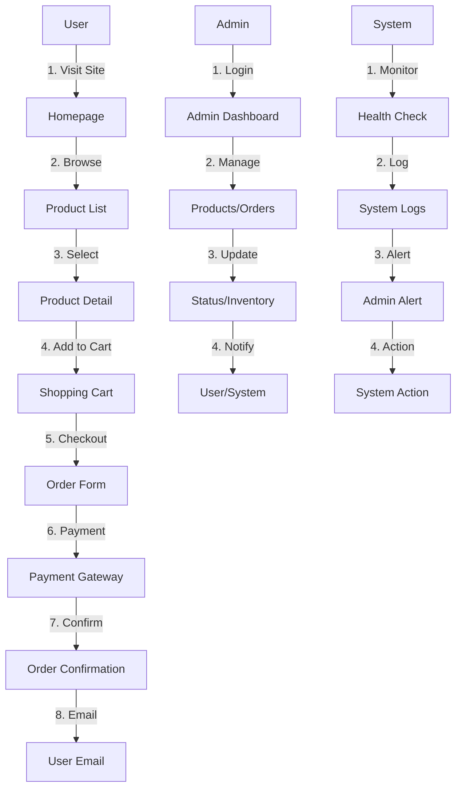
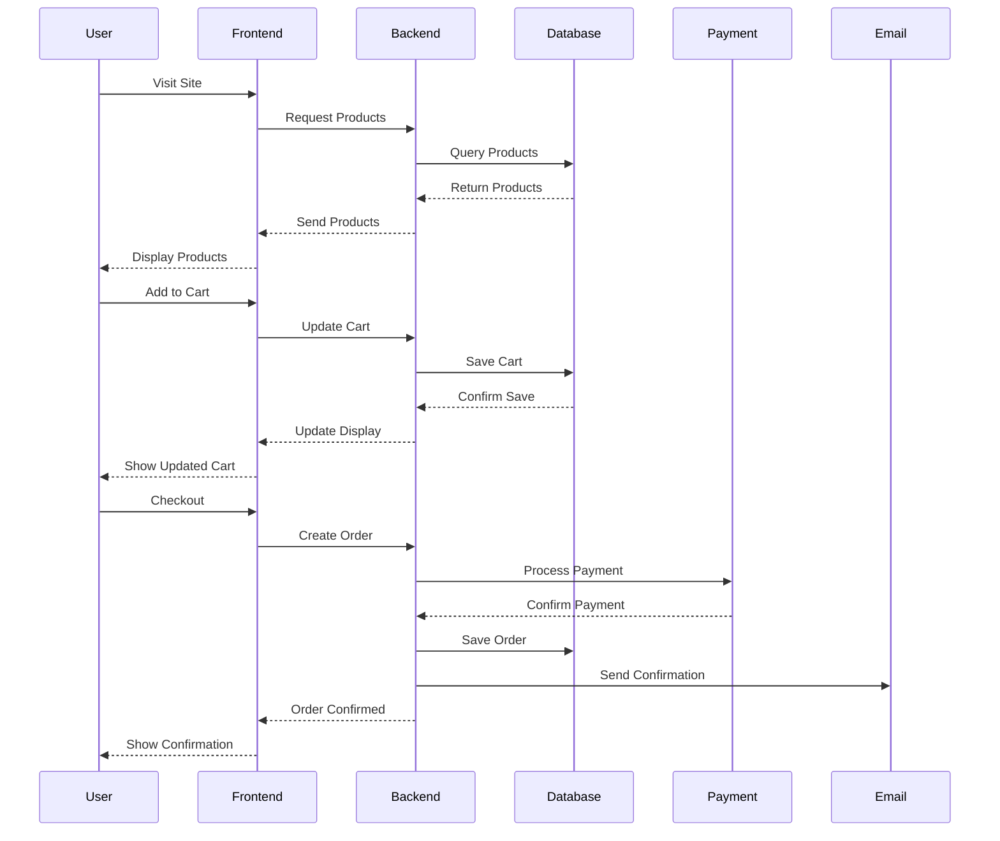
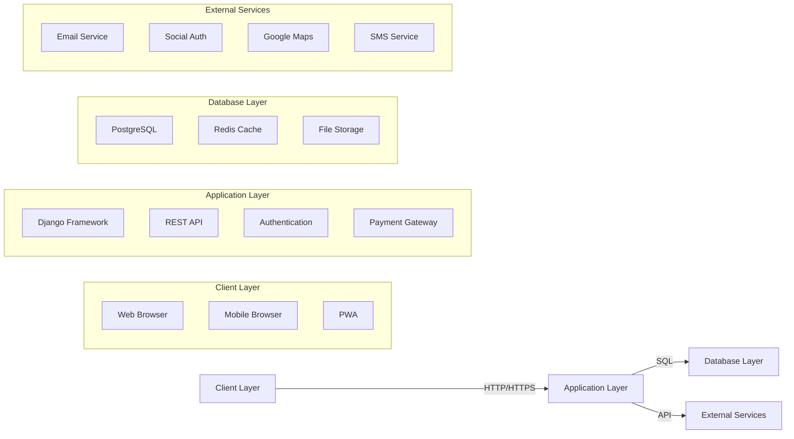

```mermaid
graph TD
    A[User] -->|1. Visit Site| B[Homepage]
    B -->|2. Browse| C[Product List]
    C -->|3. Select| D[Product Detail]
    D -->|4. Add to Cart| E[Shopping Cart]
    E -->|5. Checkout| F[Order Form]
    F -->|6. Payment| G[Payment Gateway]
    G -->|7. Confirm| H[Order Confirmation]
    H -->|8. Email| I[User Email]
    
    J[Admin] -->|1. Login| K[Admin Dashboard]
    K -->|2. Manage| L[Products/Orders]
    L -->|3. Update| M[Status/Inventory]
    M -->|4. Notify| N[User/System]
    
    O[System] -->|1. Monitor| P[Health Check]
    P -->|2. Log| Q[System Logs]
    Q -->|3. Alert| R[Admin Alert]
    R -->|4. Action| S[System Action]
```

```mermaid
sequenceDiagram
    participant User
    participant Frontend
    participant Backend
    participant Database
    participant Payment
    participant Email
    
    User->>Frontend: Visit Site
    Frontend->>Backend: Request Products
    Backend->>Database: Query Products
    Database-->>Backend: Return Products
    Backend-->>Frontend: Send Products
    Frontend-->>User: Display Products
    
    User->>Frontend: Add to Cart
    Frontend->>Backend: Update Cart
    Backend->>Database: Save Cart
    Database-->>Backend: Confirm Save
    Backend-->>Frontend: Update Display
    Frontend-->>User: Show Updated Cart
    
    User->>Frontend: Checkout
    Frontend->>Backend: Create Order
    Backend->>Payment: Process Payment
    Payment-->>Backend: Confirm Payment
    Backend->>Database: Save Order
    Backend->>Email: Send Confirmation
    Backend-->>Frontend: Order Confirmed
    Frontend-->>User: Show Confirmation
```

```mermaid
graph LR
    A[Client Layer] -->|HTTP/HTTPS| B[Application Layer]
    B -->|SQL| C[Database Layer]
    B -->|API| D[External Services]
    
    subgraph Client Layer
        A1[Web Browser]
        A2[Mobile Browser]
        A3[PWA]
    end
    
    subgraph Application Layer
        B1[Django Framework]
        B2[REST API]
        B3[Authentication]
        B4[Payment Gateway]
    end
    
    subgraph Database Layer
        C1[PostgreSQL]
        C2[Redis Cache]
        C3[File Storage]
    end
    
    subgraph External Services
        D1[Email Service]
        D2[Social Auth]
        D3[Google Maps]
        D4[SMS Service]
    end
``` 